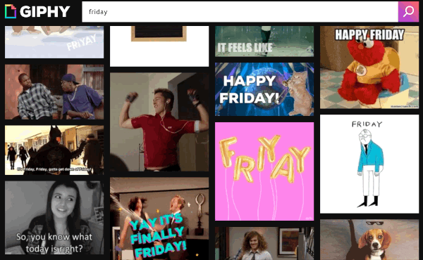

We use GIFs everywhere these days. From being an obscure part of meme culture, they are now a part of every main communication channel. 

You can share GIFs on social media, as part of your blogpost, and these days they are even supported by Outlook. 

I've seen GIF's used in everything from Buzzfeed (of course) to explainers for difficult to understand economic corruption cases. 

We use GIF's in messaging, either via 3rd party custom GIF keyboards, or directly built in to our favorite IM tool, to Apple iMessages and even in the workplace via Slack or Teams. 

This last part is crucial, because one of the main vendors here is called [Giphy](https://giphy.com), and it just got acquired by [Facebook for $400 million](https://www.axios.com/scoop-facebook-to-buy-giphy-for-400-million-4a75a359-833b-484d-b15b-87e94d3de017.html) (official statement [here](https://about.fb.com/news/2020/05/welcome-giphy/)). 

Giphy is by far the biggest GIF hub on the internet, worth enough for Facebook - the _biggest_ site on the internet - to pay such an enormous amount of money for it and not just build their own. 

Giphy has been trusted by so many products as an easy way to support GIFs in their apps or social platforms. You search for keywords like `thank you` or `sad` or `friday`, and Giphy will bring up thousands of options ready for you to send away to your friends or coworkers.

Tap the GIF you want and it will sent as a message. It's so easy. Giphy has social features built in to their platform (you can create an account and make a list of your favorite GIFs), but it's mainly a _utility_ powering other apps with a comprehensive library of GIF's, a search engine juiced up on metadata, and a nice [API and SDK](https://developers.giphy.com/) to implement in to your own product.

## What is Facebook going to do?
Facebook has always been about growth, dominance and advertising. So now that they own Giphy, a couple of options spring to mind:
1. Keep Giphy all for themselves - essentially cutting of the panacera of GIFs from competitors and SaaS products to boost their own platform. About 50% of Giphy's traffic [comes from Facebook's apps](https://about.fb.com/news/2020/05/welcome-giphy/), namely Instagram, so this will also give Facebook more control over the experience within their products.
2. Use Giphy to run ads - think promoted GIFs in the top of the search results.
3. Let Giphy continue as before, using the SDK to pick up data about usage and users.

Time will tell what exactly they'll do. Facebook has a very good track record of making profits with their acquisitions, and I doubt this will be any different. 

## Have GIF's become too centralized?
The GIF is essentially just a file format, and everyone can produce one with a bit of technical knowhow and the right tools. 

But the GIF is increasingly something we _consume_, a common reference of internet culture - often based on popular TV shows or movies. 

GIF's often require you to be in on the meme and to understand a vast, growing set of  references to popular cultures or internet moments. 

Finding a really good GIF to support your message or selecting the perfect reaction GIF can be seen as a skill in itself. It's possible to upload your own GIF's to Giphy, but it's surprisingly hard to find and use them in an app afterwards. 

This means Giphy essentially has control over the _GIF language_ that we speak when we use GIF's, because the control the search result algorithm returned by a query.
Furthermore, Giphy is an American company, and the vast majority of GIFs come from American popular culture.

This is of course neither strange - most large Internet companies are based out of the U.S - nor is it a problem in itself. Many platforms are English first, but have great support for internationalisation.

I can use Airbnb or Spotify in my native Danish with every UI element translated, or I can use iMessage, Twitter or Slack and only write messages in Danish. 

## We should have local GIF libraries

For Giphy localisation is a different, because *you can't choose local GIFs*. Think about this for a moment. 

This post is in English, but I could have written it in Danish. But I can't write a Giphy query in my native tongue. I _have_ to write `thank you` or `sad` or `friday`. I can't write `tak`, `trist` or `fredag`. So every time I'm writing something in Danish, I have to mentally shift to English to express myself visually via a GIF.

Even worse, I can't bring up any results that are native to my local country's popular culture. Now, I'm no nationalist and fully support that the Internet should be open and global. But I miss being able to weave in local references. 

The Danish Broadcasting Corporation (DR) is trying to add [GIFs from their productions](https://giphy.com/danmarksradio/) to Giphy. Same goes for the [Danish Film Institute](https://giphy.com/filminstituttet). But the amount of GIF's is very small compared to how big the cultural legacy actually is. 

Danish Internet culture has a lot of memes based in popular culture, being spread either as still image or as short video clips stored on Youtube. But there should be a way to do the same for GIFs. It's as if a part of our vocabulary is missing from the internet. 

I suppose this is most pronounced for smaller countries like my own. But there should really be a way to localise GIF's.
Maybe you could have a dropdown in the Giphy search SDK to choose your local version. 
Or a query parameter, so you could search for `dk:tak` or `dk:fredag` and get all your local results. 

I think we need something. 

## An open source Giphy

Giphy is amazing and I hope it continues to be. But we need a decentralised, open source version with support for localisation and internationalisation. 

Countries invest a lot in conserving their cultural heritage across museums, libraries, support for local content produced in the native language. 

There should be public initiative to do the same for GIFs to make sure we keep the Internet truly global. 

GIFs are a part of the language of the Internet, and we need to embrace and protect that. 

And I would just personally love to get more awesome GIFs from Olsen Banden:

