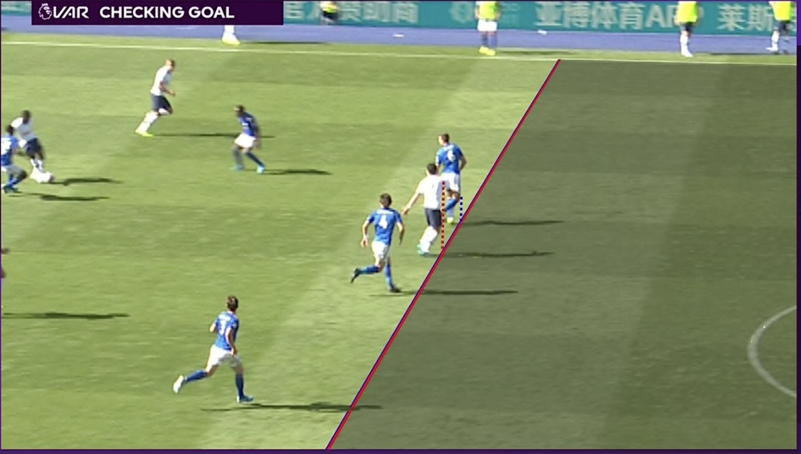

It was the summer of 2018. Denmark was playing Australia. Eriksen scored a dream of a goal. But wait, what’s going on?

The referee points two fingers to the sky. Then he draws an invisible square in front of himself.

I can’t believe it. It’s VAR.

For years, I, along with many others, had been thinking that VAR — the video assisted referee — would be such a great idea. Every time a referee made the wrong call, you would see it in the instant replay on your TV moments later. Why shouldn’t the referee be able to watch the instant replay just like the millions of viewers at home? Clearly, a video assisted referee would be a great idea.

Oh, how naive we were. As it turned out, VAR is more annoying than a wrong call. Every time there is any doubt in a soccer match, the game pauses, and you have to wait for a decision from the VAR-room, and sometimes the referee has to run out and look at the screen for themselves. VAR may be more precise, but it ruins the experience of playing and watching the game. We are relying on technology in a way, that would seem obvious, but it is actually making us feel worse.

## Tech is a means to an end, not a solution in itself

When we look at a problem, our first impulse is often to think how it can be solved with technology. We hear of emerging tech from the countless trends reports and the Gartner Hype Cycle and we become afraid of missing out on the New New Thing.

But technology should be an enabler, a tool, a means to an end — not the solution in itself. We have a responsibility to look at a problem from many different angles — technology being one of them — and then determine what will be the best solution. If new technology is part of that solution, we need to account for all the steps towards the goal.

Sometimes you come up with the best idea, a product solution you really wish existed. But the technology isn’t mature or the effort needed to make it fly, is too high. Want to use machine learning to analyse the climate footprint of your groceries? Cool — who’s going to label our data and train the ML model to work, in order for the AI solution to do its thing?

More importantly, we must take into consideration the possible side effects or even misuse of the technology we implement or create. Shows like Black Mirror takes this to the extreme, but the bad cases are already here, such as smart home devices being turned into devices of domestic abuse.

Even something as positive sounding as ‘Like’ features on social media platforms might have contributed to comment sections becoming overwhelmingly negative: when you are positive, you can tap ‘like’ or ‘heart’, but when you want to leave negative feedback, your only option is to write a comment.

## Focus on the problem, not the tech

It can of course be good in the creative process to use new tech as a catalyst for idea generation. But what happens when we look at an existing problem, then apply new technology to it? What is possible now, that was not possible 10 years ago. Or 5 years ago, or just 1 year ago?

Technologies like AR, blockchain, VR, voice assistants, IoT etc. could all be part of any creative process. But all ideas should then be valued against a harsh set of criteria to move to the next phase. Is the idea viable for the business? Is it feasible to build and run? Is it even desirable for the end-user? Ask yourself: Is this AR activation something people will spend more than 5 minutes on? Do we have the internal ressources to maintain IoT over the whole product lifecycle?

## Boring is good

I am no luddite — in fact, I love experimenting with new technology and learning about breakthroughs and future possibilities. But I am increasingly becoming in favour of solutions that are, well, boring.

We are often tempted to do stuff that look cool, that will do things in a new, different or unexpected way, that will look great in a portfolio or maybe get the nod from an award show. But for most cases, we are here to solve problems.

We are here to make it easier for people to get the job done, convey some information in a clear or desirable way, in general, be helpful towards solving any problem they may have. Well-written support pages or service minded staff that respond to your email really fast sound boring in a pitch deck, but they are extremely effective solutions.

The point is, a lot of solutions could be boring but good. They should do what people expect, in a functional, beautiful way.

Digital products are built on years and years of conventions and the best UX practices and design principles that still holdup today. Sometimes, a new thing comes along, but it often takes a big product like Snapchat (Stories) or Facebook (bottomnavigation in app) to push a pattern from obscurity to mainstream. Not to mention the many innovations of the iPhone, liketapping, swiping and pinching. But for the most part, it’s completely fine to stick to what works.

The point is, a lot of solutions could be boring but good. They should do what people expect, in a functional, beautiful way.

The NemID app is incredibly boring, but it does one thing really well. I use it almost every day. The Kindle Paperwhite is grayscale and feels slow to navigate. But it has a long battery life and is absolutely perfect for books.

Both are boring products. And I absolutely love them.

Technology is not always the solution. Maybe it creates other problems than the ones it’s trying to solve. Or the cost of implementing is as big as the possible savings.

That’s why we must be willing to choose boring solutions. Black text on white background is boring, yet it’s the best way to convey the written word — without having to use blockchain, VR or the newest Javascript framework.

The great designers or developers of today know what technology can and cannot, but more importantly they know when tech is a part of the solution and when it’s just a gimmick.

We should all have the courage to experiment, to constantly learn and challenge norms and conventions. But please, also have the courage to be boring. Sometimes, technology won’t fix it.

Even if your soccer team just got a draw against Australia.
